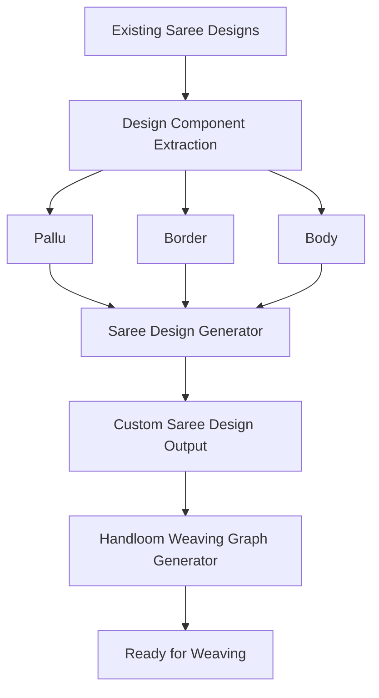

# 👗 SareeFusion

**AI-Powered Saree Design Automation Tool for Custom Handloom Weaving**

SareeFusion is an intelligent design automation platform that enables users to create personalized saree designs by combining different **Pallu**, **Border**, and **Body** patterns. The system generates a complete saree design and produces a **handloom-ready weaving graph**, bridging the gap between customer preferences and traditional weaving.

---

## 📖 Overview

Choosing a saree often requires customers to compromise because they like the pallu of one saree, the border of another, and the body of a third. SareeFusion solves this problem by allowing users to mix and match different design components into a single customized saree.

Once the design is finalized, the system automatically generates the corresponding weaving graph, making it suitable for handloom production.

---

## ✨ Features

- 🎨 Mix and match saree components
  - Pallu
  - Border
  - Body
- 👗 Generate personalized saree designs
- 🧵 Produce handloom-ready weaving graphs
- 📂 Upload and manage design datasets
- ⚡ Fast and automated design generation
- 🖥️ User-friendly interface
- 💾 Save generated designs

---

## 🚀 Workflow

1. Upload or select existing saree designs.
2. Extract individual components:
   - Pallu
   - Border
   - Body
3. Select desired combinations.
4. Generate a new customized saree.
5. Produce the weaving graph.
6. Export the final design.

---

## 🏗️ System Architecture

---

## 🛠️ Technologies Used

### Frontend

- HTML
- CSS
- JavaScript

### Backend

- Python
- Flask

### Image Processing

- OpenCV
- NumPy
- Pillow

### Other Tools

- Git
- GitHub

---

# Project Structure

saree-fusion
    |- backend 
        |-image_generation module
        |-loom_generation module
        main.py
    |- frontend
---

## 🎯 Applications

- Handloom Industry
- Saree Retailers
- Textile Designers
- Custom Saree Manufacturing
- Fashion Industry

---

## 🔮 Future Enhancements

- AI-based design recommendation
- Pattern similarity search
- GAN-generated saree designs
- Mobile application
- 3D saree preview
- User accounts and order management
- Direct integration with Jacquard weaving machines
- Cloud deployment

---
